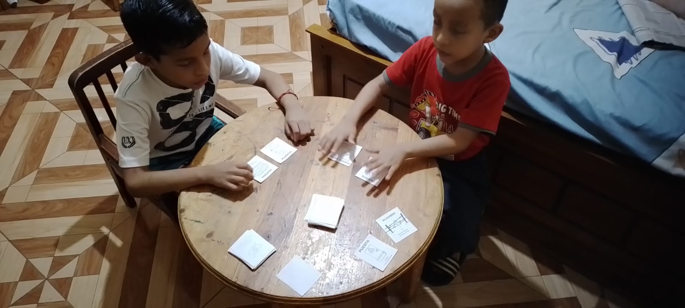

## Testing
Se mostrara los Testing realizado a lo largo del proyecto
## Playtesting 1 (3 jugadores) ## 

## Anotaciones: 
-	Idea de posible sistema de reputación en base a tarjetas
-	Idea de eliminar a la niña y crear un personaje de secuestrador que te pueda atrapar o complicarte la partida. 
-	No se sabe si terminar la partida al ganar un jugador o seguir hasta que quede solo un perdedor. 
## Futuros Cambios:
- Implementar mazo de la niña fantasma que puede ayudar o no al jugador. 
- Agregar tarjetas de salas que necesitan objetos para salir de ellas, objetivo es complicar la partida del jugador. 

## Playtesting 2 (3 jugadores)  ## 
### Versión Juego 1: 
Una parte del juego fue impresa y además se agregaron tarjetas de obstáculos para crear salas y complicar el juego. 

## Anotaciones: 
-	Esta partida fue hecha con 2 personas que no forman parte del equipo de ideación.
-	Cuando quedan pocas tarjetas de crea un bucle sin fin en el que ninguno puede ganar.
-	Los jugadores se quedan con las cartas sueltas que necesita otro y ninguno quiere ceder para que exista un ganador, necesario encontrar manera de quitárselas.

## Futuros Cambios:
- Eliminar el personaje de la niña e implementar un mazo de secuestrador que complique el juego y te quite tarjetas cada vez que te encuentre.
- Poner un límite de cartas sueltas para que la devuelvan al mazo y no crear el bucle.

## Playtesting 3 (2 jugadores)   ## 
### Versión Juego 1.1: 
Se agrega el personaje del secuestrador en forma de tarjeta evento. Se entregan las tarjetas obstáculos al principio de la partida para crear la sala de la que tiene que escapar. Se agrega la mecánica de conseguir x tarjetas de “liberar” para poder escapar. 

## Anotaciones: 
-  Idea de eventos secuestrador: quitar objetos fase vehículo o fase puerta
-  Idea: Si te sale 3 veces el secuestrador te mata 
- Hacer que los objetos de energía puedan abastecer toda una sala

## Futuros Cambios:
- Crear una carta de secuestrador y un mazo aparte con sus acciones
- Crear más obstáculos
- Más acciones de secuestrador para su mazo

## Playtesting 4 (2 jugadores)   ## 
### Versión Juego 1.2:  
Se agrega el personaje del secuestrador como una tarjeta escondida en la baraja general de los objetos, además de implementar “mazo del secuestrador” con penitencias. Se agregan los nuevos objetos y el número ideal de obstáculos para ser repartido entre 4 personas. 

## Anotaciones: 
-	Solo hay una tarjeta del secuestrador y le sale siempre a la misma persona en toda la partida, será necesario agregar más de esta.
-	Sera necesario quitar todos los objetos guardados si el secuestrador te encuentra para evitar crear el bucle y tener más cartas en el mazo general.
-	Idea de agregar una forma de robar artículos a otro jugador. 

## Futuros Cambios:
- Agregar 2 tarjetas de secuestrador si hay 3 jugadores. En caso de tener 4 jugadores serian 3 tarjetas de secuestrador.
- Regla de quitar los objetos guardados si te sale la tarjeta del secuestrador.
- Agregar Tarjetas de “no te ha visto” en el mazo del secuestrador como relleno y no complicar tanto la partida  
- Agregar tarjetas de sabotaje y más eventos de secuestrador. 

<!-- Esta es la descripción de la imagen 1. -->
<!-- 

Esta es la descripción de la imagen 2.

Esta es la descripción de la imagen 3. -->