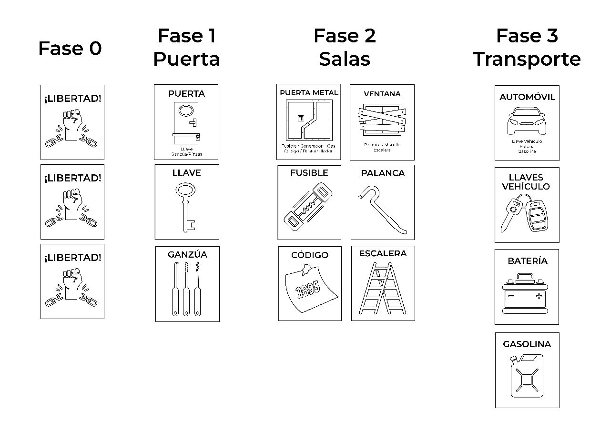

# Explicacion 

## Fases
Las fases son columnas rellenadas por las tarjetas de objetos y obstáculos siguiendo el siguiente orden. 

* ### Fase 0: 
Estado inicio – Todos los jugadores están amarrados, para liberarse tienen que conseguir 2 tarjetas de “liberación” 

* ### Fase 1: 
Puerta - Siempre hay que desbloquear una puerta al inicio (Solo se permiten las tarjetas de puertas que tengan un símbolo) 
 
* ### Fase 2: 
Sala - Puede estar conformada por 2 o más tarjetas obstáculos (Las tarjetas obstáculo se reparten al inicio de cada partida) 
 
* ### Fase 3: 
Transporte - Reparar un vehículo para escapar con los objetos que saques de la baraja. 

## Preparación del juego 

1.	Barajar el mazo de obstáculos y entregar en partes iguales a cada jugador. Cada uno debe tener 2 tarjetas de obstáculos (4 jugadores) 
2.	Barajar y entregar 1 tarjeta puerta (Las que tienen un símbolo solamente) a cada jugador.  
3.	Mezclar las tarjetas secuestrador en la baraja de objetos principal. Estas mismas definen el nivel de dificultad del juego. Recomendado: con 4 jugadores solo 3 tarjetas de secuestrador.  

## Reglas 
* Al dar una carta a otro jugador se pierde un turno. 
* Solo se pueden tener 2 tarjetas sueltas, sobrante debe ser devuelto a la baraja 
* Si te toca la tarjeta “secuestrador”, debes tomar una de la baraja de este mismo. Si eres atrapado, todas las tarjetas sueltas deben volver a la baraja. 
 

