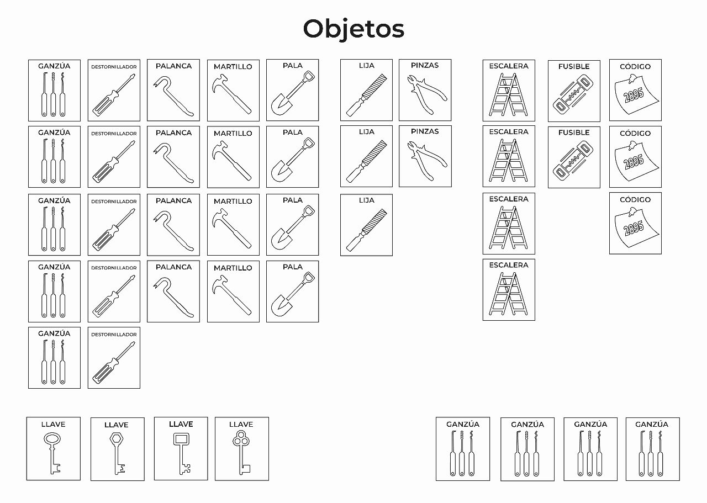
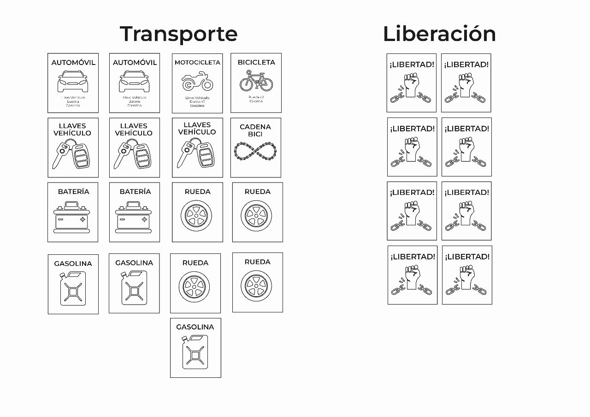
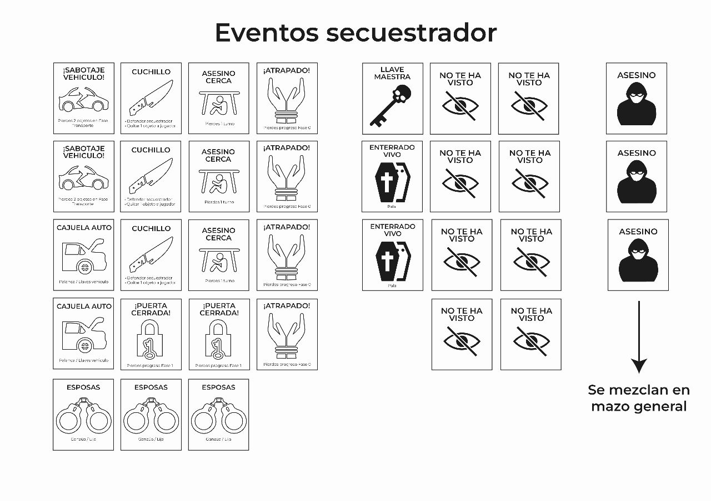
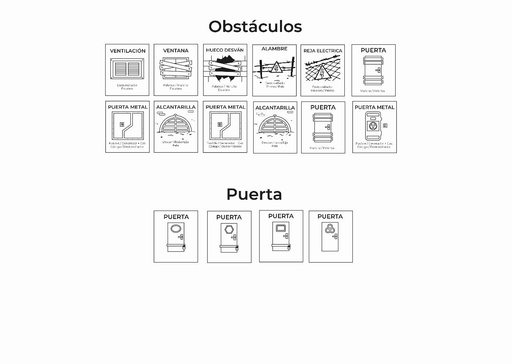

# Tarjetas
Existen 3 mazos principales:

### General: 
Conformado por todos los objetos, llaves, vehículos y las tarjetas de secuestrador 

### Secuestrador: 
Todos los eventos del secuestrador

### Obstáculos: 
Todos los obstáculos y las tarjetas de puertas

